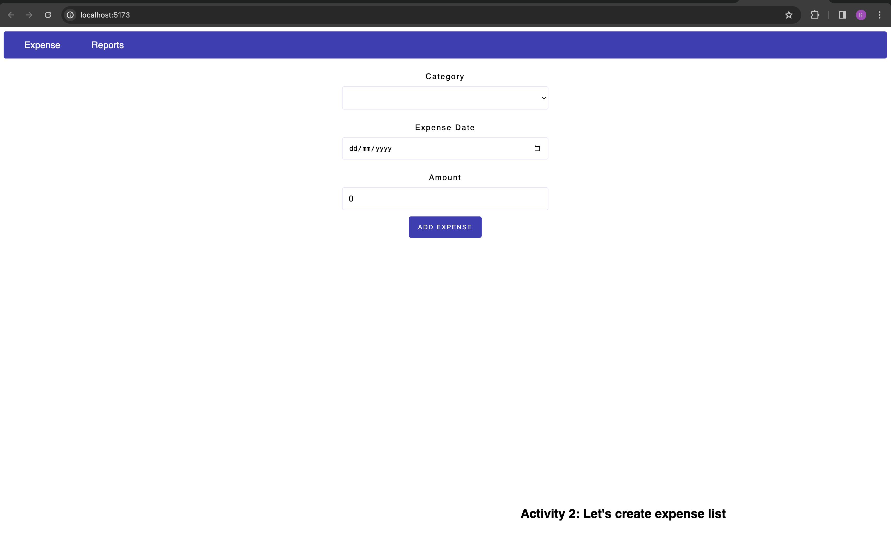

## To run the app

```bash
npm run dev -- --open
```
You should be able to see 


## Activity
Let's show added expense in the list,

TODO:
1. Add ExpenseList componet in ```src/routes/[...expense]/+page.svelte```
2. Pass expenses properties to the ExpenseList component ```src/components/ExpenseList.svelte```

Hint: I have explicitly mentioned TODO: in the code, use it to finish the activity